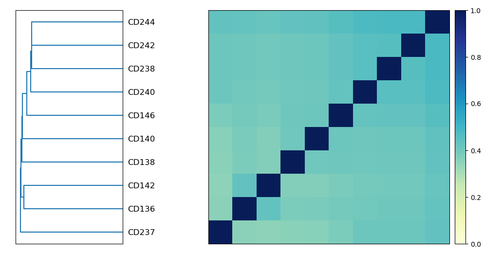
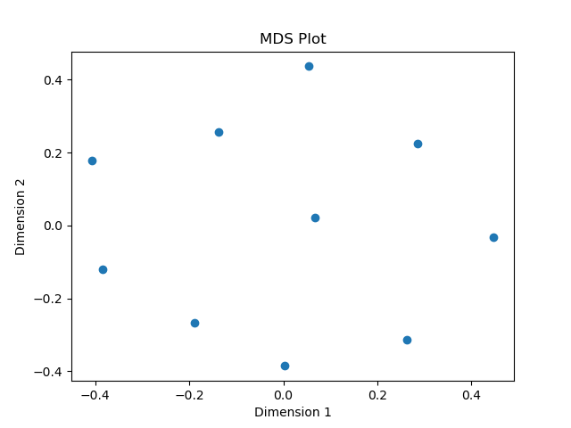
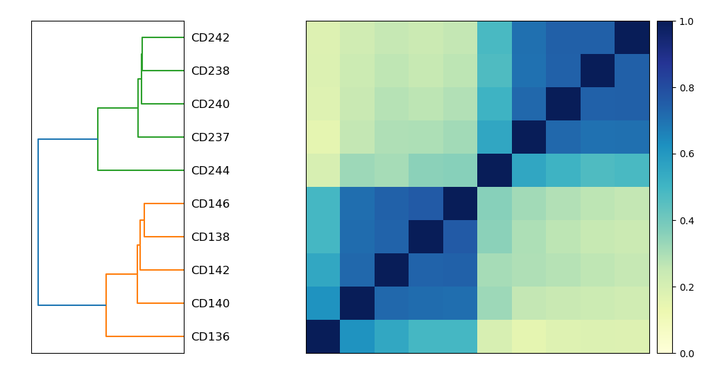
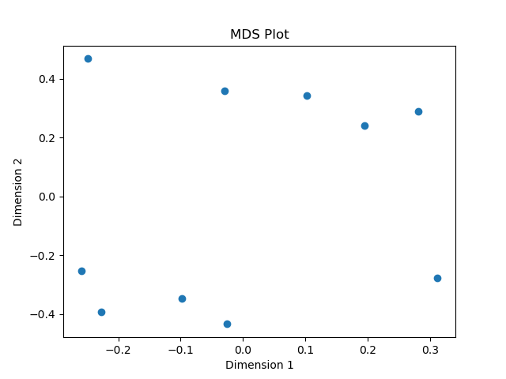

# Comparing metagenomes

## First, create a conda software environment and a working directory.

To install software, run:
```
mamba create -n smash -y sourmash scikit-learn
conda activate smash
```

Then create a directory for this tutorial:
```
mkdir ~/compare-metag
cd ~/compare-metag
```


## Comparing based on content

* reference free, annotation free @CTB

Here we are going to use the
[`sourmash plot`](https://sourmash.readthedocs.io/en/latest/command-line.html#sourmash-plot-cluster-and-visualize-comparisons-of-many-signatures)
command to compare and cluster many metagenomes based on their content.

As with the [single metagenome analysis](single-metagenomes-taxonomy.md), we have two options here: with, or without abundance information.

If we use abundance information, we will be comparing the genomic
*diversity* of the data set.  In this kind of comparison, if two
samples have the same dominant species, but many different species
at lower abundances, the two samples will appear to be quite similar.

If we discard abundance information and just focus on genomic content,
we will be looking at *richness*. In this kind of comparison, samples
with similar dominant species but many lower abundance species will look
very different.

<!-- @CTB we could do a gather of a different sample here, and show case. -->

### Non abundance-weighted comparison of species composition & richness

Let's first compare all of the samples without abundances, using only
presence/absence of sequences.

Run:
```
sourmash compare ../data/tutorial_other/CD*.sig.zip \
    -o compare.flat.cmp -k 31 --ignore-abund
```

and then plot:

Run:
```
sourmash plot compare.flat.cmp
```

You will get a file `compare.flat.cmp.matrix.png` that looks like this:



Points to discuss:

* neither the distance matrix nor the dendrogram on the left show strong
  signs of clustering.
  
You can convert the distance matrix to an MDS plot where you will see that
there is no clear clustering there either, of course (since it's a different
view of the same data).

Run:
```
../scripts/ordinate.py compare.flat.cmp -o compare.flat.mds.png
```



### Abundance-weighted comparison of diveristy

Now let's compare the samples using content abundance. This uses the
cosine similarity between the abundance vectors of the sequences, rather
than just the presence/absence vector.

Run:
```
sourmash compare ../data/tutorial_other/CD*.sig.zip \
    -o compare.abund.cmp -k 31
```

And then plot.

Run:
```
sourmash plot compare.abund.cmp
```

and you will see the following, in a file `compare.abund.cmp.matrix.png`.



Points to discuss:

* unlike the previous figures, here we see a clear set of clustering that
  corresponds to sample origin.

If you plot this via MDS, you'll see a clear separation:

```
../scripts/ordinate.py compare.abund.cmp -o compare.abund.mds.png
```



Points to discuss:

* what does this all mean, in ~microbial terms? Hint: ask Mani to
  revist how the test data sets were generated!

<!--

## Comparing based on taxonomy


```
mamba create -y -n workshop-r r-base r-tidyverse r-vegan r-ape r-rcolorbrewer

```

-->
