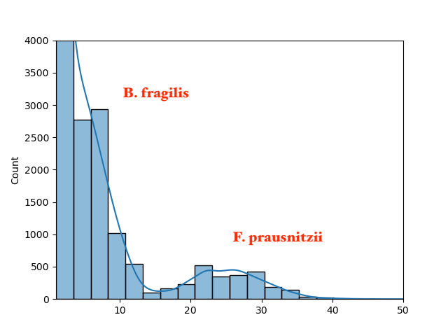
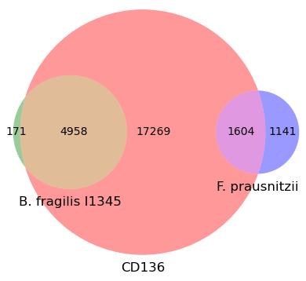

# Analyzing a single metagenome for taxonomy

The tutorial uses [sourmash](https://sourmash.readthedocs.io/) to do
various k-mer based analyses of Illumina shotgun metagenome content.

In this tutorial, you will learn:

* how to look at what genomes share content with a metagenome;
* how to examine the abundance of metagenome content without a reference;
* how to summarize the taxonomic content of a metagenome;

## Creating a working directory

Run:
```
mkdir ~/single-metag/
cd ~/single-metag/
```

## Installation

First let's install the necessary software. We'll be using
[the sourmash software](https://sourmash.readthedocs.io/en/latest/index.html)
along with a few sourmash plugins.

```
mamba create -n tax -y sourmash sourmash_plugin_branchwater
conda activate tax
pip install sourmash_plugin_abundhist sourmash_plugin_venn
```

## Basic membership analysis of the metagenome

Now let's convert the CD136 metagenome into sourmash sketch format
[(docs)](https://sourmash.readthedocs.io/en/latest/command-line.html#sourmash-sketch-make-sourmash-signatures-from-sequence-data):

```
sourmash sketch dna -p abund \
    ../data/IBD_tutorial_subset/metag/1-trimmed/CD136/*.fq.gz \
    --name CD136 -o CD136.sig.zip
```

And search it against the latest
[Genome Taxonomy Database (GTDB)](https://gtdb.ecogenomic.org/)
containing all known genomes. We'll do the primary search with the
'fastgather' extension to sourmash.

Run:
```
sourmash scripts fastgather CD136.sig.zip \
    ../databases/gtdb-rs214-k31.zip -o CD136.x.gtdb-rs214.fastgather.csv -c 16
```
(This will take about 3 minutes.)

Display the results of the first search in a nicer format using
'sourmash gather'
[(docs](https://sourmash.readthedocs.io/en/latest/classifying-signatures.html#analyzing-metagenomic-samples-with-gather).

Run:
```
sourmash gather CD136.sig.zip \
    ../databases/gtdb-rs214-k31.zip -o CD136.x.gtdb-rs214.gather.csv \
    --picklist CD136.x.gtdb-rs214.fastgather.csv:match_name:ident
```

You should see the output below. What does this mean?
```
overlap     p_query p_match avg_abund
---------   ------- ------- ---------
5.0 Mbp       27.5%   96.7%       7.3    GCF_000598785.2 Bacteroides fragilis...
3.6 Mbp       10.3%   64.2%       3.8    GCF_009678525.1 Parabacteroides dist...
3.2 Mbp        4.6%   59.0%       1.9    GCF_015550345.1 Bacteroides uniformi...
1.6 Mbp       30.7%   58.4%      25.3    GCA_023708525.1 Faecalibacterium pra...
3.6 Mbp        1.2%    8.0%       3.8    GCF_009024595.1 Parabacteroides dist...
1.6 Mbp        5.6%   10.2%      25.1    GCF_017377615.1 Faecalibacterium sp....
2.6 Mbp        0.5%    3.3%       3.7    GCF_015548395.1 Parabacteroides dist...
1.6 Mbp        2.3%    5.1%      24.6    GCA_905199165.1 Faecalibacterium pra...
3.5 Mbp        0.2%    1.9%       2.8    GCA_009678725.1 Parabacteroides dist...
2.1 Mbp        0.1%    1.5%       1.9    GCF_009020375.1 Bacteroides uniformi...
3.3 Mbp        0.2%    1.5%       3.6    GCF_015552355.1 Parabacteroides dist...
1.6 Mbp        1.4%    2.4%      25.2    GCF_000166035.1 Faecalibacterium cf....
4.0 Mbp        0.3%    1.1%       7.3    GCF_009024655.1 Bacteroides fragilis...
1.6 Mbp        1.0%    1.9%      25.3    GCA_019425405.1 Faecalibacterium sp....
found less than 50.0 kbp in common. => exiting

found 14 matches total;
the recovered matches hit 86.0% of the abundance-weighted query.
the recovered matches hit 61.7% of the query k-mers (unweighted).
```

Points to discuss:

* 13 matches were found! This means that significant portions of 13
  different GenBank genomes matched to some part of the metagenome.
* based on the abundance-weighted matches, 86.0% of the metagenome
  reads will map to at least one of these genomes. This means that
  at least 86% of the metagenome content is known!
* based on the unweighted matches, 61.7% of the metagenome's genomic
  content is present in the reference database.  Some of this is
  probably erroneous data or host contamination.
  
### K-mer abundance histogram

Let's examine this data set further. First, let's take a look at the
abundance spectrum of the metagenome content. This is an annotation and
reference-free exercise: we're just counting content.

Run the abundhist plugin:
```
sourmash scripts abundhist CD136.sig.zip \
    --max 50 --bins 20 --figure CD136-abundance.png \
    --ymax 4000
```
This will produce a file `CD136-abundance.png`, which will look approximately
like this:

)

Points to discuss:

* this is a histogram of sequence content, separated by abundance.
* the X axis is the abundance, the Y axis is how much of the content is at
  that abundance.
* you would expect a peak for each species present.
* for this simple mock metagenome, there are two peaks: one under 10, one around 30.
* we do not know what these species are based on this diagram, but we can annotate them based on the avg_abund column in the sourmash gather output above.

### K-mer overlap between metagenomes and two genomes

Now, since (based on the gather output and the abundance histogram) we
think there are two major species, let's take a look at the overlap of
genomes of these species with the entire metagenome.

We do this with the Venn plugin. But first we need to extract and rename
the matches we're interested in comparing:

Run:
```
sourmash sig grep "GCF_000598785.2" ../databases/gtdb-rs214-k31.zip \
    -o GCF_000598785.2.sig.zip
sourmash sig grep "GCA_023708525.1" ../databases/gtdb-rs214-k31.zip \
    -o GCA_023708525.1.sig.zip

sourmash sig rename GCF_000598785.2.sig.zip "B. fragilis I1345" \
    -o B.fragilis.sig.zip
sourmash sig rename GCA_023708525.1.sig.zip "F. prausnitzii" \
    -o F.prausnitzii.sig.zip
```

And now generate a 3-way Venn diagram:
```
sourmash scripts venn -k 31 CD136.sig.zip B.fragilis.sig.zip \
    F.prausnitzii.sig.zip -o CD136-venn.png
```

In the resulting figure `CD136-venn.png` (see below), multiply numbers
by 1000 to get number of bases. CD136 (the red circle) is the entire
metagenome.



Points to discuss:

* the metagenome CD136 contains a mixture of content from whatever
  genomes are present.
* based on the gather output, we can see two major species (also see
  taxonomy results below): *B. fragilis* and *F. prausnitzii*.
* This Venn diagram illustrates their genomic overlap with the k-mer
  content of the metagenome. This is not weighted by abundance: the size
  of the circles is relative to the genome size.
* We can see that the *B. fragilis I135* genome is almost entirely
  contained in the metagenome. Based on the p_match column from the gather
  output above, it is 96.7% present in the metagenome!
* In contrast, the *F. prausnitzii* genome is just a bit more than half
  contained in the metagenome (p_match is 
  
Questions to ask:

* why are these genomes not entirely present (100% overlap)?
    * low coverage
    * strain variation
* what ELSE might be in the metagenome??
    * contamination
    * unknown genomes (see morning session)

## Summarizing taxonomy

Prepare the taxonomic lineages file so that the commands run fast.

Run:
```
sourmash tax prepare -t ../databases/gtdb-rs214.lineages.csv.gz \
    -F sql -o gtdb-rs214.lineages.sqldb
```

Now let's generate a human-readable taxonomic analysis at the species
level. This uses the GTDB taxonomic lineages to summarize all of the
gather matches at the species level.

Run:
```
sourmash tax metagenome -g CD136.x.gtdb-rs214.gather.csv \
    -t gtdb-rs214.lineages.sqldb -F human
```

You will see:
```
sample name    proportion   cANI   lineage
-----------    ----------   ----   -------
CD136             41.0%     92.5%  d__Bacteria;p__Bacillota_A;c__Clostridia;o__Oscillospirales;f__Ruminococcaceae;g__Faecalibacterium;s__Faecalibacterium prausnitzii_D
CD136             27.8%     95.1%  d__Bacteria;p__Bacteroidota;c__Bacteroidia;o__Bacteroidales;f__Bacteroidaceae;g__Bacteroides;s__Bacteroides fragilis
CD136             14.1%     -      unclassified
CD136             12.4%     94.7%  d__Bacteria;p__Bacteroidota;c__Bacteroidia;o__Bacteroidales;f__Tannerellaceae;g__Parabacteroides;s__Parabacteroides distasonis
CD136              4.6%     93.7%  d__Bacteria;p__Bacteroidota;c__Bacteroidia;o__Bacteroidales;f__Bacteroidaceae;g__Bacteroides;s__Bacteroides uniformis
```

we can also roll this up from species to other taxonomic ranks, like
class, by adding `-r <rank>`.

Run:
```
sourmash tax metagenome -g CD136.x.gtdb-rs214.gather.csv \
    -t gtdb-rs214.lineages.sqldb  -F human -r class
```

and you will get the above results "pulled back" to class:
```
sample name    proportion   cANI   lineage
-----------    ----------   ----   -------
CD136             44.9%     98.0%  d__Bacteria;p__Bacteroidota;c__Bacteroidia
CD136             41.0%     92.5%  d__Bacteria;p__Bacillota_A;c__Clostridia
CD136             14.1%     -      unclassified
```

Points to discuss:

* what is the "unclassified" content?
* what is cANI? (what is ANI!)

**Things for students to try out:**

* Try executing the commands for different ranks - genus, family,
  order, class, phylum, superkingdom. Do the results make sense?

---

Next tutorial: [Comparing metagenomes](comparing-metagenomes.md)
